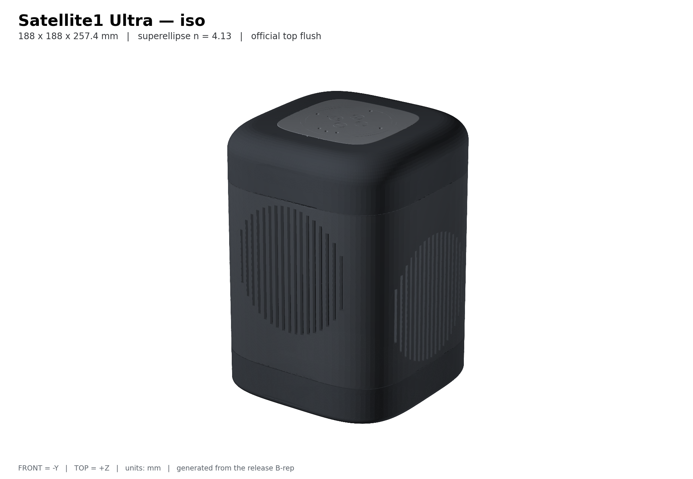

# Satellite1 Ultra

**A real speaker for your FutureProofHomes Satellite1.**

Your Satellite1 keeps its microphones, its buttons and its lights. Everything
below them gets replaced by a sealed, weighted cabinet with a 3.5&nbsp;inch
driver and a passive radiator on each side.

The body is built from the official squircle's own curve — a superellipse, not a
rounded rectangle — so the Satellite1 top sits **flush** in a single flat surface
instead of perched on a shoulder. Assembled, it reads as one object. Nothing is
glued; it all comes back apart with a hex key.



## Start here

**[Open the build guide →](https://bigpappy098.github.io/Satellite1-Ultra/)**

Four steps, a picture for every one. You never install anything — you only
download part files.

> The link goes live once this repository is public and GitHub Pages is enabled.
> Until then, run `make site` and open `site/index.html`.

| | |
|---|---|
| **1. Print eight test pieces** | Small and quick. They tell us how your printer actually lays down plastic. |
| **2. Measure them** | The site shows you where to put the calipers and which box to type each number into. |
| **3. Get your parts** | Printer dead on? Download the standard files. A little off? We generate a set corrected for *your* machine. |
| **4. Build it** | Nine steps, one picture each. Wrap it in speaker cloth at the end if you want to. |

> [!IMPORTANT]
> **Do not print the big parts first.** Skipping the test pieces is how people
> lose four days of ASA to a cabinet that will not seal. The test pieces take an
> evening.

## What you'll need

- A **Satellite1 Batch 1** kit — Core rev4.1 with HAT rev4.1. Batch 2 /
  Satellite1.1 does not fit, and there is no workaround in this design.
- A printer with **188 × 188 mm** of usable bed and about **170 mm** of height.
  The outer skin is three stacked segments rather than one tall shell, so a
  failed print costs you one segment instead of the whole body.
- **ASA** for the rigid parts (PETG works too) and a little **TPU 95A** for the
  flexible ones. You want an enclosed printer and dry filament — ASA warps
  otherwise, and a warped cabinet will not seal.
- One **Dayton ND91-4** driver and two **Dayton DSA115-PR** passive radiators,
  both from Parts Express. M3 screws and heat-set inserts, a sheet of 2 mm
  closed-cell foam, and two 6 mm steel plates.
- **M3 × ⌀4 shoulder screws with a 16 mm shoulder, ×4.** See the warning below.

It's a chunky build — about 4 out of 5 for difficulty — but there's no glue and
no soldering beyond two speaker wires.

> [!WARNING]
> **The four screws holding the Satellite1 top must be shoulder screws.** The
> shoulder bottoms out and lets the top float on rubber bushings, which stops the
> woofer shaking your microphones. With ordinary M3 screws the rubber carries
> under 3% of the load path and does nothing at all. If the top feels rock solid,
> you have the wrong screws.

## What it measures

| | |
|---|---|
| Footprint | 188 × 188 mm |
| Height | 257.4 mm |
| Sealed volume | 3.97 L |
| Printed parts | 22, plus 6 official Satellite1 top parts |
| Longest print | about 170 mm |
| Assembled mass | roughly 3.5 kg, most of it steel in the base |

## Honest status

**Nobody has built one yet.**

The geometry, clearances, seals, volumes and files all pass a strict set of
automated checks, and every part has been measured against every other part. But
no one has printed a whole one, sealed it, and put a microphone in front of it.
So fit, sealing, sound, heat, Wi-Fi and wake-word behaviour are all still
unproven.

That means **your** checks along the way aren't extra credit — they're the first
real evidence this design works. If something doesn't fit, that's genuinely
useful. Please open an issue.

---

## For developers

Everything below is for people who want to change the design. Builders don't need
any of it.

The design is parametric CadQuery source. Every part, drawing, illustration and
document in the release is generated from it — there is no hand-edited mesh and
no concept art anywhere in the deliverables. Prose is written by hand, but every
dimension inside it is interpolated from the geometry, so a guide cannot claim a
part is a size it isn't.

```text
make all
```

Python 3.12. That creates the environment from hash-locked dependencies, then
regenerates and revalidates every B-rep, export, render, guide, PDF, the
website, and the release package. It fails if anything is missing or stale.

| Command | What it does |
|---|---|
| `make check` | Lint, typecheck, build, validate, fast tests |
| `make release` | Full clean regeneration and every gate |
| `make site` | Build the illustrated website into `site/` |
| `make clean` | Remove every generated artifact |

One extra check worth knowing about, written after the gates missed a real
defect:

```text
.venv/bin/python scripts/audit_connections.py   # every bolted joint, from the solids
```

`audit_connections.py` exists because a fastener can pass a position check and
still have no material to bite into. It probes all 28 joints for a solid wall
around each insert bore and an unobstructed screw path through the mating part.

### Where things live

- Parametric source — `src/satellite1_ultra/`
- Design parameters — `config/default.yaml`, `config/components.yaml`
- Printer bed and corrections — `config/default.yaml` (`printing.build_volume_*`),
  `config/physical_calibration.yaml`
- Official assets, unmodified — `reference-assets/official/`
- Provenance and checksums — `reference-assets/MANIFEST.csv`
- Evidence — `reports/validation/`, `reports/acoustics/`
- Review findings — `reports/review/`
- Why v2 looks the way it does — `reports/V2_DESIGN_RATIONALE.md`

Generated artifacts record the commit they came from, so the build refuses to
ship a package whose CAD no longer matches its source.

### The section family

Every visible section of the enclosure is the superellipse
`|x/a|ⁿ + |y/b|ⁿ = 1` with **n = 4.13**, measured off the official lock ring to
a maximum fit error of 0.38 mm. A best-fit rounded rectangle misses the same
profile by 1.00 mm, which is why v1's body and the official top never read as one
form. See `geometry.SECTION_EXPONENT`.

The hidden structure — cabinet, divider, base — is deliberately *not* a
superellipse. Flat circular hardware needs a flat face: on a curved wall a
component seat sidewall isn't solid, a gasket land stops being a closed rim, and
a 140 mm clamp ring hangs off the corners.

### Coordinate system

- origin: center of the official mid-plate interface plane, as measured from the
  preserved B-rep.
- +Z: toward the microphones.
- -Y: active-driver front.
- +/-X: opposed passive radiators.
- Units: millimetres everywhere.

STEP is the authoritative exchange format; STL and 3MF are derived meshes. Source
geometry never uses mesh booleans, voxels, SDFs, or marching cubes.

## License

Hardware geometry is **CERN-OHL-S-2.0**. Official and manufacturer reference
assets keep their original licenses and provenance, recorded in
`reference-assets/MANIFEST.csv`.
