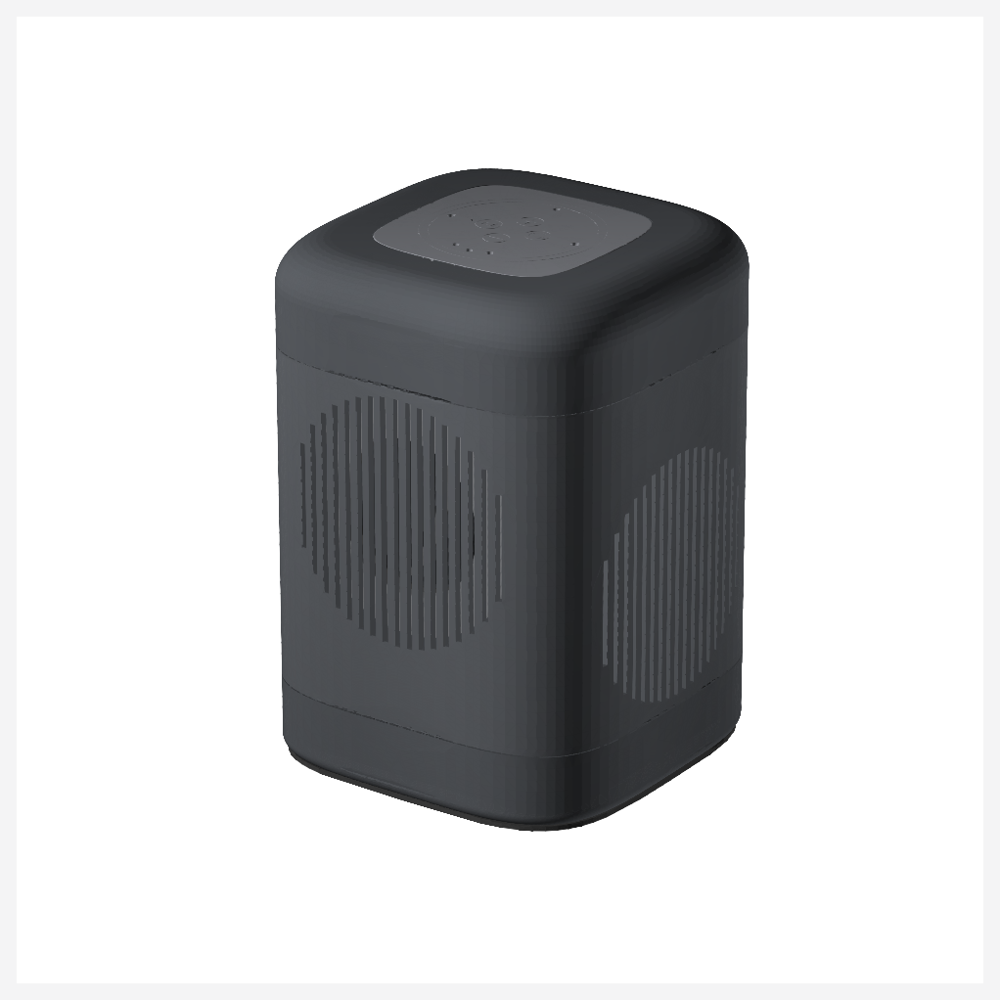

# Satellite1 Ultra

**A big-sounding speaker enclosure for your FutureProofHomes Satellite1.**

It keeps the whole Satellite1 top — microphones, buttons, lights — and swaps the
small stock speaker box for a sealed, weighted cabinet with a proper 3.5&nbsp;inch
driver and two passive radiators on the sides.



## 👉 Start here

**[Open the build guide →](https://bigpappy098.github.io/Satellite1-Ultra/)**

That website walks you through the whole thing in four steps, with a picture for
every one. You never install anything — you only download part files.

> The link goes live once this repository is public and GitHub Pages is enabled.
> Until then you can open `site/index.html` locally after running `make site`.

### How it works

| | |
|---|---|
| **1. Print 8 small test pieces** | They're quick, and they tell us how your printer actually prints. |
| **2. Measure them** | The site shows you exactly where to put the calipers and which box to type the number into. |
| **3. Get your parts** | Printer spot on? Download the normal files. A bit off? We make a set sized for *your* printer. |
| **4. Build it** | Nine steps, one picture each. Nothing is glued, so you can open it again. |

**Do not print the big parts first.** The test pieces exist so you don't waste
days of filament. It's the single most important thing on this page.

## What you'll need

- A **Satellite1 Batch 1** kit — Core rev4.1 with HAT rev4.1. Batch 2 doesn't fit.
- A printer that genuinely reaches **212 × 192 × 189 mm**. A 220 × 220 mm bed only
  works if you can really use the whole bed.
- **ASA** filament (PETG is fine too) plus a little **TPU 95A** for two bendy parts.
- One Dayton ND91-4 speaker, two SB Acoustics SB12PACR-00 radiators, M3 screws and
  heat-set inserts, a sheet of 2 mm foam, and two steel plates.

It's a chunky project — about 4 out of 5 for difficulty — but there's no glue and
no soldering beyond two speaker wires.

## Honest status

**Nothing here has been physically built and measured yet.**

The geometry, clearances, seals, volumes and files all pass automated checks, and
those checks are strict. But no one has yet printed a whole one, sealed it, and
put a microphone in front of it. So fit, sealing, sound, heat, Wi-Fi and wake-word
performance are all still unproven.

That means **your** checks along the way aren't optional extras — they're the
first real evidence this design works. If something doesn't fit, that's useful
information, and an issue report is very welcome.

---

## For developers

Everything below is for people who want to change the design. Builders don't need
any of it.

The design is parametric CadQuery source. Every part, drawing, illustration and
document in the release is generated from it — there is no hand-edited mesh and no
concept art anywhere in the deliverables.

```text
make all
```

Python 3.12. That creates the environment from hash-locked dependencies, then
regenerates and revalidates every B-rep, export, render, guide, PDF, the website,
and the release package. It fails if anything is missing or stale.

| Command | What it does |
|---|---|
| `make check` | Lint, typecheck, build, validate, fast tests |
| `make release` | Full clean regeneration and every gate |
| `make site` | Build the illustrated website into `site/` |
| `make clean` | Remove every generated artifact |

### Where things live

- Parametric source — `src/satellite1_ultra/`
- Design parameters — `config/default.yaml`, `config/components.yaml`
- Printer corrections — `config/physical_calibration.yaml`
- Official assets, unmodified — `reference-assets/official/`
- Provenance and checksums — `reference-assets/MANIFEST.csv`
- Evidence — `reports/validation/`, `reports/acoustics/`
- Review findings — `reports/review/`

Generated artifacts record the commit they came from, so the build refuses to ship
a package whose CAD no longer matches its source.

### Coordinate system

- origin: center of the official mid-plate interface plane, as measured from
  the preserved B-rep.
- +Z: toward the microphones.
- -Y: active-driver front.
- +/-X: opposed passive radiators.
- Units: millimetres everywhere.

STEP is the authoritative exchange format; STL and 3MF are derived meshes. Source
geometry never uses mesh booleans, voxels, SDFs, or marching cubes.

## License

Hardware geometry is **CERN-OHL-S-2.0**. Official and manufacturer reference
assets keep their original licenses and provenance, recorded in
`reference-assets/MANIFEST.csv`.
