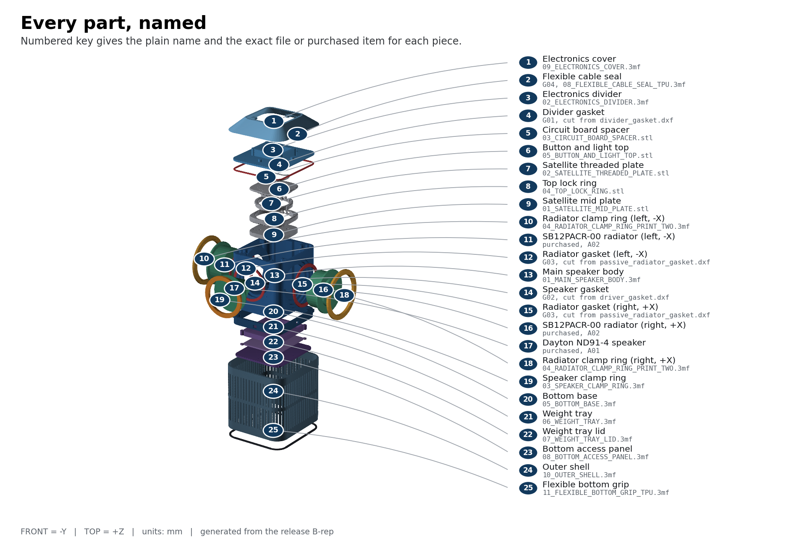

# Satellite1 Ultra

A serviceable, passive-radiator speaker enclosure for the
[FutureProofHomes Satellite1](https://futureproofhomes.net) **Batch 1**
development kit. It keeps the official Squircle upper stack — microphones,
buttons, LEDs and all — and replaces the small stock speaker chamber with a
sealed, ballasted cabinet carrying one 3.5&nbsp;inch driver and two opposed
passive radiators.

Everything here is generated from parametric CadQuery source. There is no mesh
editing, no concept art, and every illustration in the guides is rasterised
from the same B-rep the STEP files come from.



> **Do not print the full enclosure yet.**
> Print and measure the eight small calibration pieces first. They exist so you
> find out how your printer really behaves before you spend days of filament.

## Start here

| If you want to… | Go to |
|---|---|
| **Build one** | `release/Satellite1-Ultra-RC1.zip` → open `SATELLITE1_ULTRA_BUILD_BOOK.pdf` |
| **Correct the files for your printer** | The [calibration wizard](#calibration-wizard) — runs in your browser |
| **Change the design** | [Building from source](#building-from-source) |
| **Check the engineering** | `reports/validation/`, `reports/acoustics/`, `docs/ENGINEERING_APPENDIX.md` |

The Build Book is the only document you need to follow front to back. Every
other guide is reference material it points you to at the moment you need it.

## What you need

- **Printer:** at least 212 × 192 × 189 mm of genuinely usable travel (X/Y may be
  swapped). The outer shell is the limiting part at 192 × 212 × 189 mm printed
  upright. A 220 × 220 × 200 mm machine works only if the whole bed is usable.
- **Materials:** ASA (PETG is a documented alternative) plus TPU 95A for two parts.
- **Electronics:** Satellite1 **Batch 1** only — Core rev4.1 with HAT rev4.1 /
  R2024.12.06. Satellite1.1 / Batch 2 does not fit and is not supported.
- **Purchased:** one Dayton Audio ND91-4, two SB Acoustics SB12PACR-00, M3
  hardware, EPDM foam, and two steel ballast plates. Full list in `docs/BOM.csv`.

Expected difficulty is 4 out of 5. Nothing is glued; every joint is a screw
into a brass heat-set insert, so it opens again for service.

## Calibration wizard

Printers vary. The wizard turns what you measured on the calibration pieces
into a corrected set of build files.

1. **Open the wizard in your browser.** It is published from `wizard/` by the
   *Publish calibration wizard* workflow — the page URL appears in that
   workflow's summary, and on the repository's Pages settings. Nothing is
   installed, and nothing you type leaves your machine.
2. **Enter your measurements.** It checks every value against the same safe
   limits the build system enforces, and tells you immediately if a number is
   out of range or your gasket squeeze is wrong.
3. **Rebuild.** Either:
   - **In the browser** — open the Actions tab, run **Calibrated build**, paste
     the file the wizard gave you, and download the `calibrated-release`
     artifact when it finishes; or
   - **Locally** — save it to `config/physical_calibration.yaml` and run
     `make calibrated-release`.

If you prefer a terminal, `python scripts/calibrate.py` asks the same questions
and rebuilds in one step.

## What is in the release package

- `SATELLITE1_ULTRA_BUILD_BOOK.pdf` — the whole build, front to back.
- Six reference PDFs: calibration, printing, assembly, hardware, testing, maintenance.
- `PRINT_THESE_FILES/` — three numbered folders. Print only from these.
  Calibration pieces first, then the Ultra parts, then the six Squircle top parts.
- `OFFICIAL_PARTS/REQUIRED_SINGLE_MATERIAL/` — the six official Squircle STL
  files, preserved byte for byte with their provenance and checksums.
- `GASKET_TEMPLATES/` — 1:1 DXF templates for the three cut foam gaskets.
- `BOM.csv`, `FASTENERS.csv`, `GASKETS.csv` — the authoritative schedules.
- `STEP/`, `STL/`, `3MF/`, `IMAGES/` — production CAD and every illustration.
- `SOURCE_CHECKSUMS.txt` — SHA-256 for everything above.

Print every required custom Ultra 3MF **and** every file in
`OFFICIAL_PARTS/REQUIRED_SINGLE_MATERIAL/`. Do **not** print the official
original speaker chamber, speaker plate, or anti-slip ring — the Ultra parts
replace all three.

## Project status

**`DIGITAL_PROTOTYPE_READY`. Not physically validated.**

Every gate in this repository is a digital check: geometry validity, wall
thickness, clearances, collisions, acoustic volume, export fidelity, and
document consistency. No physical unit has been built and measured.

Printed fit, sealing, acoustic output, thermal margin, Wi-Fi, microphones,
buttons, LEDs, and wake-word behaviour are all
`REQUIRES_PHYSICAL_VALIDATION`. Your calibration and commissioning checks are
part of the build, not optional extras. Open risks and how to close them are in
`docs/ENGINEERING_APPENDIX.md` and `docs/RISK_REGISTER.csv`.

## Building from source

Python 3.12 is required.

```text
make all
```

`make all` creates the isolated environment from hash-locked dependencies, then
`make release` regenerates and revalidates every B-rep, acoustic report,
STEP/STL/3MF export, render, drawing, guide, PDF, mutation report, and the
release package. It fails if any required artifact is missing or stale.

| Command | What it does |
|---|---|
| `make check` | Lint, typecheck, build, validate, fast tests |
| `make release` | Full clean regeneration and every gate |
| `make calibrated-release` | Validate your calibration input, then `make release` |
| `make clean` | Remove every generated artifact |

Generated artifacts record the source commit they came from. Editing anything
under `src/`, `config/`, or the pinned reference assets marks existing exports
stale, so the build refuses to ship a package whose CAD no longer matches its
source.

### Where things are defined

- Parametric B-rep source — `src/satellite1_ultra/`
- Design parameters — `config/default.yaml`, `config/components.yaml`
- Your printer corrections — `config/physical_calibration.yaml`
- Official unmodified assets — `reference-assets/official/`
- Provenance and checksums — `reference-assets/MANIFEST.csv`
- Digital evidence — `reports/validation/`, `reports/acoustics/`

### Coordinate system

Origin is the centre of the official mid-plate interface plane, measured from
the preserved B-rep. **+Z** points at the microphones, **−Y** is the
active-driver front, and **±X** are the opposed passive radiators. Units are
millimetres everywhere.

STEP is the authoritative exchange format; STL and 3MF are derived meshes.
Source geometry never uses mesh booleans, voxels, SDFs, or marching cubes.

## License

Project hardware geometry is **CERN-OHL-S-2.0**. Official and manufacturer
reference assets keep their original licenses and provenance, as recorded in
`reference-assets/MANIFEST.csv`.
