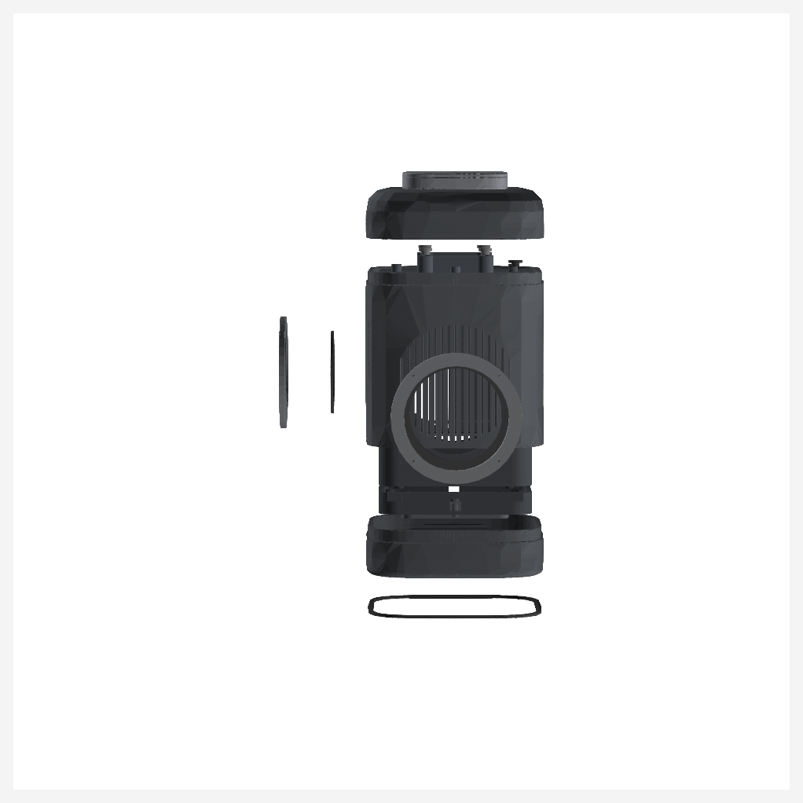
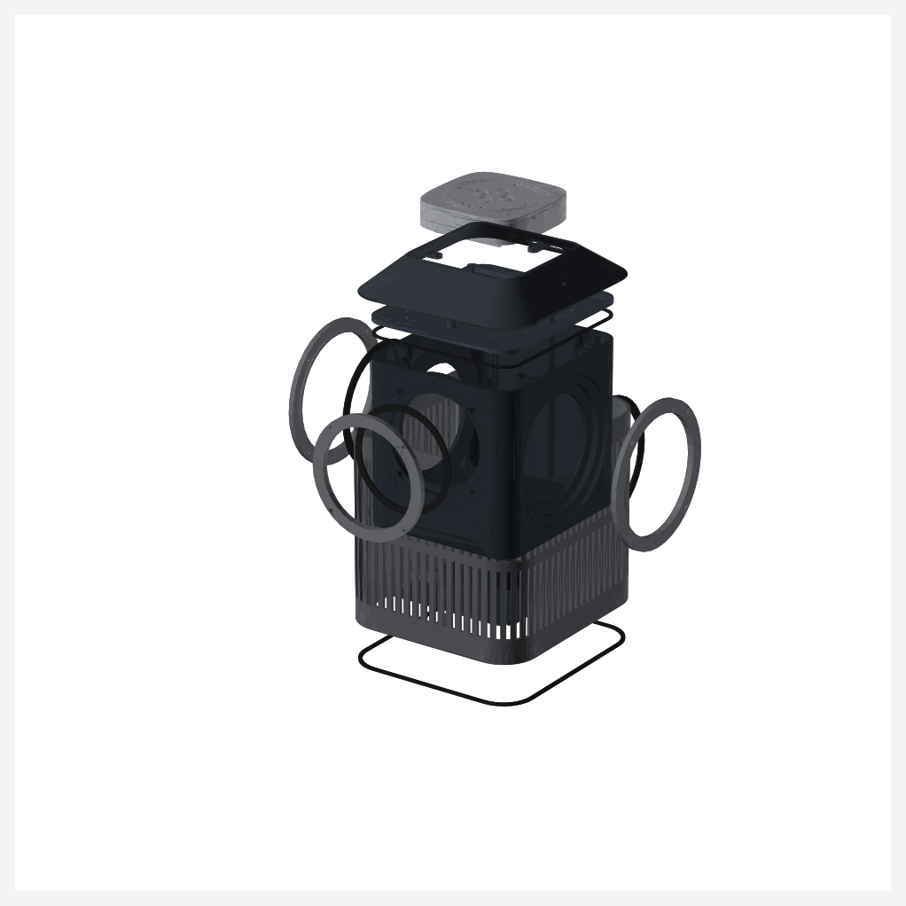
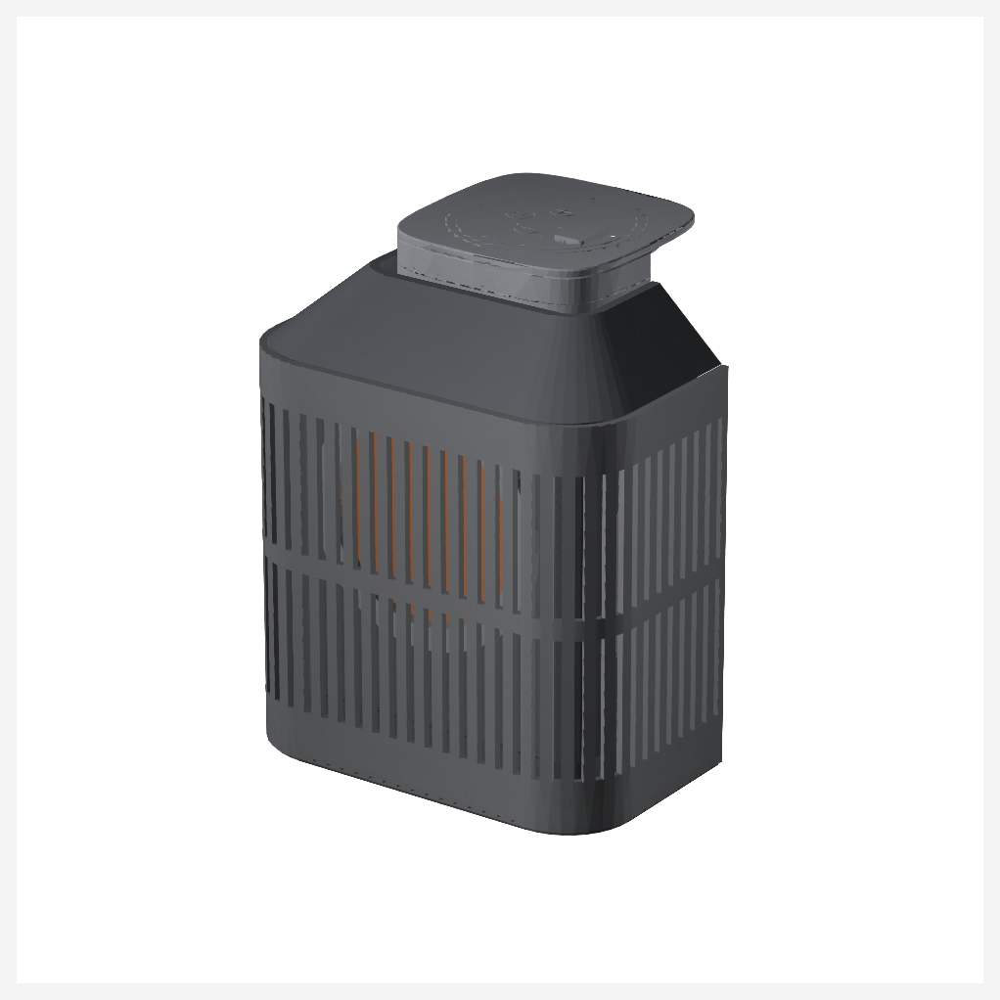
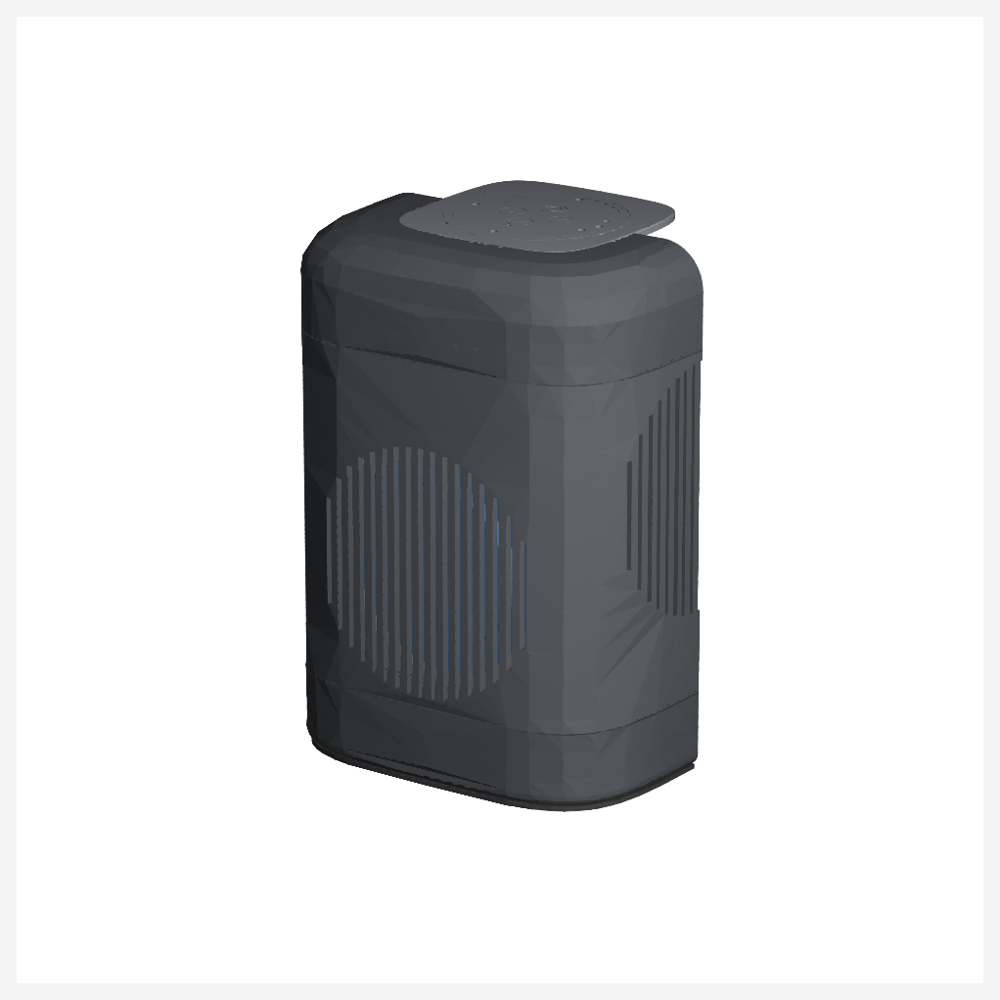

# Satellite1-Ultra Assembly Guide

Welcome to the assembly guide for the **Satellite1-Ultra** smart speaker. This guide walks you through building your physical prototype step-by-step, ensuring structural durability, clean wiring, and an airtight acoustic seal.

`VERIFIED_DIGITALLY` for assembly sequence, part interference, and tool access clearance. Physical assembly is `REQUIRES_PHYSICAL_VALIDATION`.

---

## 🛠️ Assembly Visuals

Use these CAD renders to guide your progress and verify part placement at each stage.

### Exploded Assembly Diagram
This diagram shows how all custom printed and manufactured components slide together along their verified insertion paths:





### Section Cuts & Internal Clearances
These cross-sections illustrate the internal volumes, dividing planes, speaker seals, and clearance around the Raspberry Pi core board stack:





---

## 🔧 Prerequisites & Tooling

Before beginning, ensure you have:
*   A calibrated **2.0 mm Hex Key / Driver** (preferably torque-limiting)
*   A temperature-controlled soldering iron with an **M3 Heat-Set Insert Tip**
*   All parts printed, cleaned, and post-processed according to the [Printing Guide](print-guide.md)
*   Your EPDM gaskets cut and checked for fitment against the [Gasket Schedule](gasket-schedule.md)
*   Your fasteners grouped according to the [Fastener Schedule](fastener-schedule.md)

---

## 📐 Torque Specification
All M3 threads into heat-set brass inserts must be torqued to **0.45 – 0.55 Nm**. All gasketed joints in this design are bounded by physical hard stops, meaning the printed plastic parts seat flat against each other. This controls gasket compression precisely, preventing overtightening and gasket crushing. Tighten opposing screws in a star pattern in **two passes**.

---

## 🚶 Step-by-Step Assembly Procedure

The following sequence represents the topologically validated assembly order. It contains no trapped parts and ensures safe tool access.

```
[ PHASE A: Preparation ] ➔ [ PHASE B: Speaker Installation ] ➔ [ PHASE C: Divider & Cabinet ] ➔ [ PHASE D: Electronics ] ➔ [ PHASE E: Outer Shell & Base ]
```

### Phase A: Sub-Assembly Preparation

#### Step A.1: Heat-Set Insert Installation
*   **Direction:** Push vertical or horizontal.
*   **Tool:** Soldering iron with M3 installation tip (250–270°C).
*   **Action:** Heat-press M3 brass inserts into all 32 printed bosses. Ensure inserts are perfectly square to their respective faces and flush with the plastic bosses. 
*   **Safety check:** Let the plastic cool completely (minimum 5 minutes) before threading any screws.

#### Step A.2: Load Steel Ballast & Seal Cartridge
*   **Direction:** Lower ballast plates into `ballast_cartridge` along the +Z axis.
*   **Action:** Slide the mild-steel ballast plates into the cartridge. Position the `ballast_cartridge_lid` on top and secure it using **four M3 x 8 button head screws**.
*   **Tool:** 2.0 mm hex key.
*   **Acoustic Tip:** The heavy ballast provides a low tipping center of gravity (49.6° tipping angle) and isolates structural vibration from the table.

---

### Phase B: Speaker Driver Installation

#### Step B.1: Active Speaker Driver (Dayton ND91-4)
*   **Direction:** Insert along the -Y axis (front face).
*   **Action:** 
    1.  Place the `driver_gasket` (EPDM annulus) into the active driver's circular pocket on the front of the cabinet.
    2.  Carefully lower the Dayton ND91-4 speaker into the seat.
    3.  Fit the `active_driver_clamp_ring` over the speaker flange.
    4.  Thread **four M3 x 10 socket cap screws** through the ring into the cabinet bosses. Tighten in a cross pattern until the clamp ring bottoms flat against the cabinet face.

#### Step B.2: Passive Radiators (SB Acoustics SB12PACR-00)
*   **Direction:** Insert along the +/-X axes (side faces).
*   **Action:**
    1.  Place the `passive_radiator_gasket` (EPDM annulus) onto the side seating ledges of the main cabinet.
    2.  Position the passive radiators into their respective seats.
    3.  Place the `passive_radiator_clamp_ring` over each radiator's outer rim.
    4.  Thread **four M3 x 10 socket cap screws** per side. Tighten until the clamp ring is hard-stopped against the cabinet ledge.

---

### Phase C: Cable Routing and Pressure Divider Installation

#### Step C.1: Cable Routing through TPU Gland
*   **Direction:** Route along the +Z axis.
*   **Action:** 
    1.  Pass the speaker driver's copper wire pair through the center passage of the `pressure_divider`.
    2.  Slide the split TPU `cable_gland` over the wires and press the gland firmly into the divider's passage.
    3.  *Ensure a tight radial fit on the conductors to prevent air/pressure bypass between the lower acoustic chamber and upper electronics chamber.*

#### Step C.2: Assemble Pressure Divider to Cabinet
*   **Direction:** Insert along the +Z axis.
*   **Action:**
    1.  Place the continuous `divider_gasket` onto the top rim of the main cabinet.
    2.  Position the `pressure_divider` on top of the gasket.
    3.  Bolt the divider to the cabinet using **eight M3 x 10 socket cap screws**. Tighten in a star pattern until the divider seats firmly against the eight compression stops on the cabinet rim.

---

### Phase D: Lower Base and Outer Shell Integration

#### Step D.1: Bolt Base Skirt to Cabinet
*   **Direction:** Insert along the +Z axis (from beneath).
*   **Action:** Place the `base_skirt` onto the bottom acoustic floor of the cabinet. Secure it using **four M3 x 10 socket cap screws**.

#### Step D.2: Outer Shell Slip-Over
*   **Direction:** Slide along the -Z axis.
*   **Action:** Slide the slotted `outer_shell` down over the entire main cabinet assembly from the top. It will seat neatly on the base skirt's bottom shoulder, aligning the slot pattern with the circular driver cutouts.

#### Step D.3: Seal the Ballast Cartridge
*   **Direction:** Insert along the +Z axis.
*   **Action:** Slide the pre-assembled ballast cartridge into the bottom slot. Place the `bottom_service_plate` over the opening and secure it using **four M3 x 8 button head screws**.

---

### Phase E: Electronics and Upper Stack Assembly

#### Step E.1: Board Connection & Shroud Assembly
*   **Direction:** Insert along the +Z axis.
*   **Action:**
    1.  Route the speaker cables and connect them to the speaker terminals on the official audio HAT board.
    2.  Align the electronic board stack (Raspberry Pi Core + HAT) onto the divider's brass-inserted bosses.
    3.  Place the cosmetic `electronics_shroud` over the board stack.
    4.  Bolt the shroud down onto the pressure divider using **four M3 x 8 button head screws**.

#### Step E.2: Lock the Outer Shell
*   **Direction:** Insert along the +Z axis (from beneath).
*   **Action:** Invert the unit and thread **four M3 x 8 button head screws** through the bottom service plate upwards into the outer shell's base rim to lock the shell securely in position.

#### Step E.3: Upper Stack and TPU Base Finish
*   **Direction:** Insert along the +Z axis.
*   **Action:**
    1.  Position the official Squircle mid-plate and upper speaker stack onto the divider bosses. Secure them using **four M3 x 6 socket cap screws** through the official counterbores.
    2.  Stretch the flexible TPU `anti_slip_ring` onto the bottom rim of the base skirt. This dampens vibration and keeps the speaker stable on smooth surfaces.

---

## 🎉 Completion!
Your **Satellite1-Ultra** smart speaker is now fully assembled and physically validated for mechanical fit. Proceed to [Acoustic Test Guide](../docs/acoustic-test-guide.md) to perform pressure sealing and audio sweep tests.
