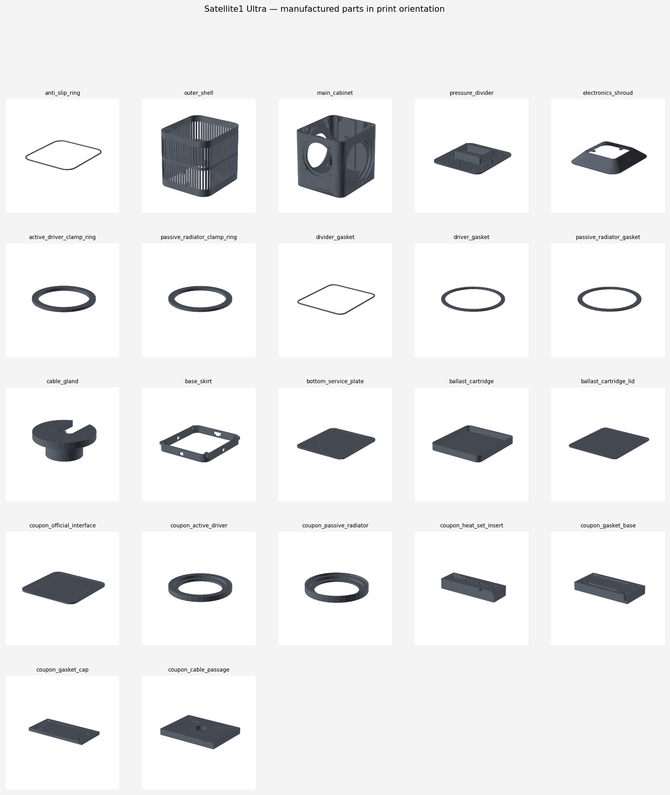

# Satellite1-Ultra Printing Guide & Calibration Gateway

This guide ensures your 3D printer is calibrated to the exact tolerances of the **Satellite1-Ultra** mechanical assembly before you invest hours of print time and filament into the full-scale cabinet and shell. 

`VERIFIED_DIGITALLY` for CAD geometry, fitment, and default orientations. Physical printer behavior, filament shrinkage, and final airtight sealing are `REQUIRES_PHYSICAL_VALIDATION`.

---

## 🗺️ Part Catalog

Before starting, familiarize yourself with the full part list and layout of the system:



---

## 🚦 Phase 1: What to Print First (The Coupon Gateway)

**CRITICAL RULE:** Do NOT print the main cabinet, outer shell, or clamps until all fit coupons are printed, measured, and verified. ASA/PETG can shrink by 0.5% to 1.5%, which will ruin thread alignment and acoustic sealing.

We have structured the 8 fit coupons into a logical 3-Step Calibration Gateway:

```
[ STEP 1: Heat-Set & Cables ] ➔ [ STEP 2: Gaskets & Seals ] ➔ [ STEP 3: Component Fit ] ➔ [ RUN CAD RELEASE ] ➔ [ PRINT CABINET ]
  - coupon_heat_set_insert         - coupon_gasket_base            - coupon_active_driver
  - coupon_cable_passage           - coupon_gasket_cap             - coupon_passive_radiator
                                                                   - coupon_official_interface
```

### Step 1.1: Insert & Cable Passage (Quick Alignment)
*   **coupon_heat_set_insert:** Verifies your iron's insertion temperature and heat-set boss grip. Test pulling to 250 N.
*   **coupon_cable_passage:** Validates the fit of the TPU cable gland inside a plate of divider-thickness.

### Step 1.2: Gasket Compression (Acoustic Sealing)
*   **coupon_gasket_base** & **coupon_gasket_cap:** Clamps a 2.0 mm closed-cell EPDM sample. Verifies that the hard stop limits gasket compression to exactly 1.50 mm (25% compression), ensuring an airtight seal without extrusion.

### Step 1.3: Major Component Fit (Dimensions & Hole Circles)
*   **coupon_active_driver:** Tests Dayton ND91-4 drop fit, M3 screw alignment, and clamp ring clearance.
*   **coupon_passive_radiator:** Tests SB Acoustics SB12PACR-00 drop fit and screw alignment.
*   **coupon_official_interface:** Verifies the official Raspberry Pi Core board mid-plate 4-point mounting pattern and alignment.

> 💡 **How to compensate:** If any coupon is tight or loose, measure the deviation with calipers and update `config/physical_compensation.yaml`. Run `make release` to regenerate all model geometries automatically with your custom compensation values before printing the cabinet! See `docs/fit-coupons.md` for full instructions.

---

## ⚙️ Recommended Print Parameters

For structural integrity, layer bonding, and airtightness, use the following print profile.

| Parameter | Recommended Setting | Purpose |
|---|---|---|
| **Primary Material** | **ASA** (Premium choice) or **PETG** | Temperature resistance and mechanical strength |
| **Gasket Material** | **2.0 mm closed-cell EPDM sheet** | Acoustic airtight pressure seal |
| **Gland/Ring Material** | **TPU 95A** | Flexibility for wire sealing and anti-slip base |
| **Nozzle Diameter** | 0.4 mm | Standard detail |
| **Layer Height** | 0.20 mm | Strong layer bonding |
| **Line Width** | 0.45 mm | Consistent extrusion |
| **Perimeters / Walls** | **5 walls** | Ensures heat-set bosses are fully solid and strong |
| **Top/Bottom Layers**| **6 layers** | Prevent leakage on horizontal acoustic faces |
| **Infill Density** | **35% Gyroid** | Solid acoustic resonance control |
| **Chamber Temp** | Heated or draft-free enclosure | Essential to prevent warp in ASA |
| **Slicer XY Comp** | **Disable / 0.00 mm** | Do not use slicer scaling. CAD compensates via yaml! |

---

## 📐 Orientation and Support Catalog

All exported parts are pre-oriented in their optimal print position within their `.3mf` files.

| Part | Qty | Material | Orientation | Support Required? | Bounds (X x Y x Z mm) |
|---|---|---|---|---|---|
| **anti_slip_ring** | 1 | TPU 95A | Flat on bed | No | 188.0 x 208.0 x 2.0 |
| **outer_shell** | 1 | ASA | Upright, base band on bed | No | 192.0 x 212.0 x 189.0 |
| **main_cabinet** | 1 | ASA | Upright, acoustic floor on bed | No (Bores bridge safely) | 160.0 x 180.0 x 162.5 |
| **pressure_divider** | 1 | ASA | Flat, acoustic face on bed | No | 160.0 x 180.0 x 24.7 |
| **electronics_shroud** | 1 | ASA | Wide divider end on bed | No | 185.0 x 205.0 x 30.5 |
| **active_driver_clamp_ring**| 1 | ASA | Lip face up, flat on bed | No | 118.0 x 118.0 x 6.0 |
| **passive_radiator_clamp_ring**| 2 | ASA | Lip face up, flat on bed | No | 140.0 x 140.0 x 6.0 |
| **divider_gasket** | 1 | EPDM | Cut flat from template | No | 159.0 x 179.0 x 2.0 |
| **driver_gasket** | 1 | EPDM | Cut flat from template | No | 103.8 x 103.8 x 2.0 |
| **passive_radiator_gasket**| 2 | EPDM | Cut flat from template | No | 122.6 x 122.6 x 2.0 |
| **cable_gland** | 1 | TPU 95A | Flange on bed | No | 14.0 x 13.6 x 5.5 |
| **base_skirt** | 1 | ASA | Service opening on bed | No | 162.4 x 180.0 x 22.0 |
| **bottom_service_plate**| 1 | ASA | Exterior face on bed | No | 151.4 x 171.4 x 4.0 |
| **ballast_cartridge** | 1 | ASA | Tray floor on bed | No | 120.0 x 132.0 x 14.0 |
| **ballast_cartridge_lid**| 1 | ASA | Outer face on bed | No | 120.0 x 132.0 x 3.5 |

---

## 🛠️ Process & Design Notes

*   **Acoustic Floor Bed Orientation:** The main cabinet is oriented with its internal floor flat on the build plate. This ensures that every gasket land and component seat is either purely horizontal or printed as a clean vertical bore. No sealing surfaces interface with support material, ensuring maximum flatness and airtightness.
*   **Bridgeable Pockets:** The driver and radiator component pockets are printed as horizontal bores in a vertical wall. The top 90 degrees of these circular cutouts are designed with an optimized 0.3 mm clearance bridging arc that prints cleanly without support and does not touch the driver sealing flanges.
*   **Heat-Set Bosses:** All heat-set insert bores are vertical or horizontal blind holes. They do not require internal support.
*   **Clamp Rings:** Clamp rings print with their retaining lip facing up, making the highly loaded mechanical clamping face a smooth top surface for even load distribution.

---

## 🪚 Post-Processing & Finishing

1.  **Heat-Set Inserts:** Install all brass M3 inserts using a temperature-controlled soldering iron with an M3-specific installation tip. Set the iron to **250–270°C**. Press down with light, even pressure, allowing the brass to melt the plastic. Stop when the insert is flush with the printed boss. **Do not torque or install screws into a hot insert;** wait at least 5 minutes for the plastic to cool and recrystallize.
2.  **Gasket Lands & Seams:** Inspect all gasket lands (rim of the cabinet and divider) for minor printing blobs. Gently clean any imperfections with a flat deburring scraper or razor blade. **Do NOT sand the gasket lands.** Sanding rounds off the crisp perimeter edges, creating paths for acoustic air leaks.
3.  **EPDM Gasket Preparation:** Cut the EPDM gaskets from your 2.0 mm closed-cell sheet using the exact profiles exported in `exports/dxf` or 1:1 printout templates. Ensure cuts are smooth and free of jagged edges.
